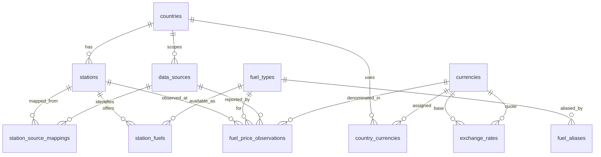

# FuelMap Europe — Database Architecture

This document describes the Milestone 2 domain schema. See `PROJECT.md` for product scope.

## Entity Relationship Overview

## Canonical Station Concept

A `stations` row represents one physical fuel retail location owned by FuelMap. Stations are **not** tied to a single external provider. Provider-specific identities live in `station_source_mappings`, keyed by `(data_source_id, external_station_id)`.

## Source Mapping Concept

`station_source_mappings` links external provider station IDs to canonical stations. The same station may have many mappings (official API, chain feed, crowdsourced report). `raw_metadata` stores provider-specific JSON for future deduplication.

## Fuel Normalization

Canonical fuel products are stored in `fuel_types`. **E5, E10, SP95, and SP98 are separate canonical types** because they represent distinct market products (ethanol content, octane rating, and pricing differ across EU markets). Country- or provider-specific labels map through `fuel_aliases` (e.g. "Super 95" → `sp95`). Do not collapse distinct products into a single enum.

Categories: `gasoline`, `diesel`, `gas`, `hydrogen`, `electric`, `other`.  
Units: `liter`, `kilogram`, `kwh`.

## Price Observation Append-Only Model

`fuel_price_observations` stores every reported price as an immutable event. Normal ingestion **never updates** existing rows. Latest prices are derived at query time (PostgreSQL `DISTINCT ON`).

## Money Precision

| Field | Type | Rationale |
|-------|------|-----------|
| `fuel_price_observations.price` | `numeric(12,4)` | Exact decimals for EUR/L and other units; max ~99M with 4 decimal places |
| `exchange_rates.rate` | `numeric(18,8)` | ECB-style FX precision |
| Application layer | string | Drizzle returns numeric as string to avoid float loss |

## ID Strategy

All primary domain entities use **UUID v4** (`uuid().defaultRandom()`). This supports future distributed ingestion, safe public exposure in APIs, and avoids sequential ID guessing. No custom ID generation.

## Timestamp Strategy

All timestamps use PostgreSQL `timestamptz` (`timestamp with timezone: true` in Drizzle). Application and database operate in UTC semantics. `observed_at` is source event time; `received_at` is ingestion time.

## Important Indexes

- `stations_location_gist_idx` — GIST spatial index on PostGIS `POINT` (SRID 4326)
- `stations_country_id_idx`, `stations_city_idx`, `stations_brand_idx` — lookup/filter
- `station_source_mappings_source_external_unique` — dedup key per provider
- `fuel_price_observations_station_fuel_observed_idx` — latest/history per station+fuel
- `fuel_price_observations_source_observed_idx` — source timeline queries
- `exchange_rates_base_quote_date_unique` — one rate per pair per day

## Deduplication Strategy (Ingestion-Level, Not Yet Implemented)

Do **not** use a DB uniqueness constraint on `(station, fuel, source, observed_at, price)` — legitimate repeated reports can occur. Recommended ingestion dedup:

1. Reject exact duplicates within a short window (e.g. same source, mapping, fuel, price, `observed_at` ± 1 minute) using application logic.
2. Prefer higher `trust_weight` sources when merging for display (future).
3. Keep all raw observations; dedup affects presentation, not storage.

## Partitioning

Not implemented at ~1,000 users. Consider range partitioning on `fuel_price_observations.observed_at` when row count exceeds ~50M or history queries degrade.

## Schema Metadata

Milestone 1 `_fuelmap_meta` is replaced by `schema_metadata` (key/value for schema version and seed timestamps).

## Intentionally Not Implemented

- Price ingestion pipelines
- ECB FX ingestion
- Station deduplication algorithm
- Geospatial nearby search
- Authentication, crowdsourcing, routing, admin UI
- `current_prices` materialized table (latest derived from observations)

## Reference Seed vs Dev Fixtures

| Command | Purpose |
|---------|---------|
| `pnpm db:seed` | EU-27 countries, currencies, fuel vocabulary |
| `pnpm db:seed:dev` | Finnish dev stations, sources, historical prices |

## Currency Note (August 2026)

Bulgaria adopted the euro on **2026-01-01**. Primary currency for BG is EUR. BGN is seeded and linked historically via `country_currencies.valid_to = 2025-12-31`.
